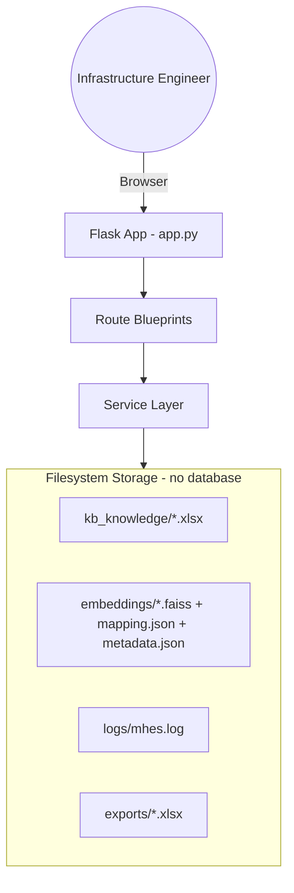
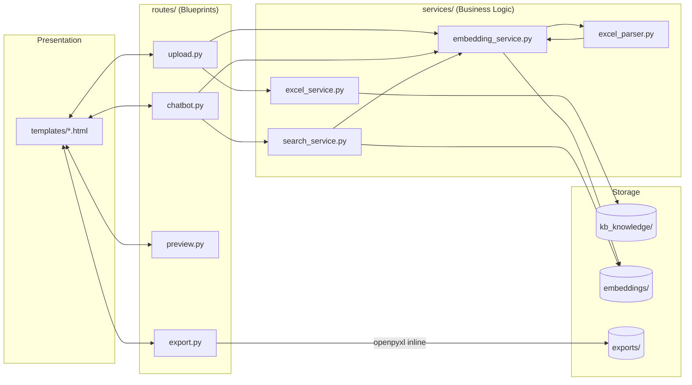
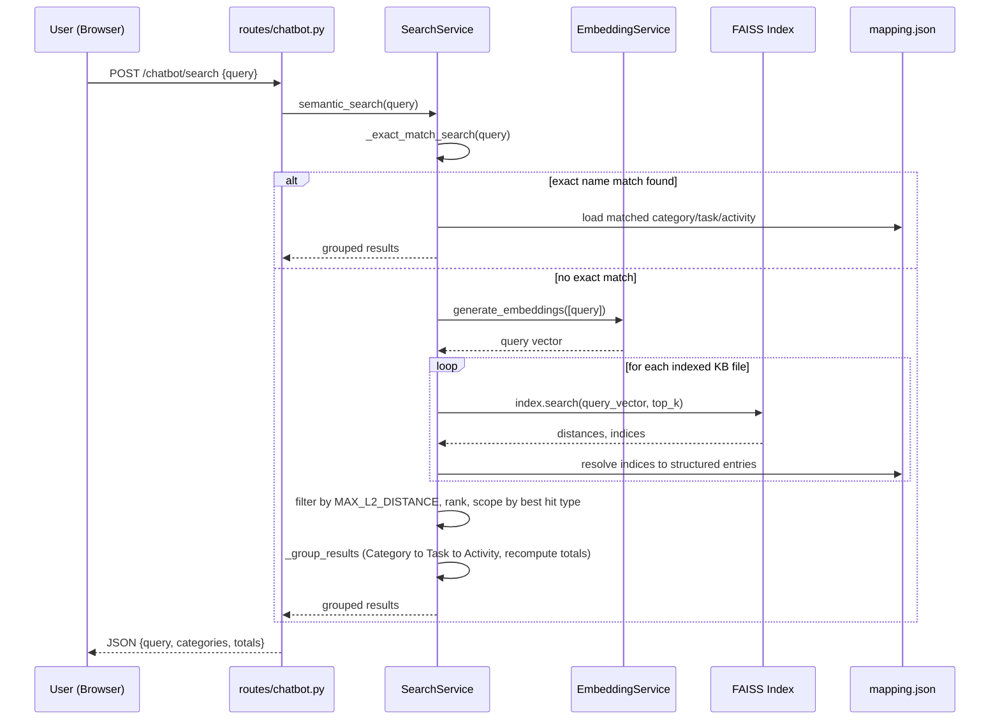
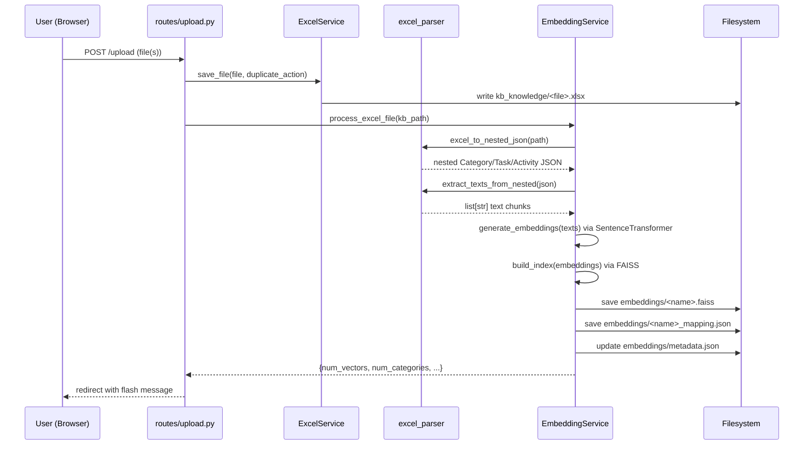

# MHES — Architecture

## 1. System Overview

MHES (Man Hour Estimation System) is a Flask web application that helps
Infrastructure Engineers estimate man-hours by searching a knowledge base of
Excel files using AI semantic search. There is no traditional database —
all state is persisted on the local filesystem (Excel files, FAISS vector
indices, and JSON metadata).

Core capabilities:
- Upload `.xlsx` knowledge files (Category → Task → Activity man-hour breakdowns).
- Automatically convert each file into embeddings (Sentence Transformers + FAISS).
- Search the knowledge base via a chatbot-style semantic search interface.
- Preview knowledge base contents.
- Export selected results back into a formatted Excel workbook.

## 2. Application Architecture

The app follows a **Flask application-factory + Blueprint + Service layer**
pattern:

- **`app.py`** — `create_app()` factory. Loads config, ensures required
  folders exist, sets up logging, registers blueprints and error handlers,
  and defines the `/` (chatbot landing page) and `/dashboard` routes.
- **`config.py`** — `Config` base class with `DevelopmentConfig`,
  `ProductionConfig`, `TestingConfig`. Defines folder paths, upload limits
  (`.xlsx` only, 10 MB max), embedding model name (`all-MiniLM-L6-v2`), and
  Ollama settings (`OLLAMA_MODEL`, `OLLAMA_BASE_URL`).
- **`routes/`** — Thin Flask Blueprints; delegate all logic to `services/`.
- **`services/`** — Business logic: Excel I/O, Excel parsing, embedding
  generation/indexing, semantic search.
- **`utils/`** — Cross-cutting helpers (logging setup, file utilities).
- **`templates/`** — Jinja2 views rendered server-side (Bootstrap 5 UI).

## 3. Frontend

Server-rendered Jinja2 templates styled with Bootstrap 5 and Bootstrap
Icons (CDN), Inter font (Google Fonts CDN). No JS build step or SPA
framework — interactivity is inline `<script>` blocks per page.

- **`templates/base.html`** — Shared shell: collapsible sidebar navigation,
  CSS custom properties/theme, common layout used via ``.
- **`templates/chatbot.html`** — Main semantic-search chat UI; posts
  queries to `/chatbot/search` and renders grouped Category → Task →
  Activity results.
- **`templates/upload.html`** — File upload UI (drag/drop multi-file),
  knowledge base file list with delete/re-embed actions and embedding
  status badges.
- **`templates/preview.html`** — Browses knowledge base data.
- **`templates/dashboard.html`** — Summary stats (KB file count, embedded
  file count) shown via the `/dashboard` route.
- **`static/css`, `static/js`, `static/images`** — Present but currently
  empty placeholders (`.gitkeep` only); all styling/JS lives inline in
  templates today.

## 4. Backend

Flask Blueprints registered in `app.py::_register_blueprints`:

| Blueprint | Prefix | File | Responsibility |
|---|---|---|---|
| `upload_bp` | `/upload` | `routes/upload.py` | Upload `.xlsx` files, duplicate detection (rename/overwrite), auto-trigger embedding generation, delete/re-embed KB files |
| `chatbot_bp` | `/chatbot` | `routes/chatbot.py` | Render chatbot page; `/chatbot/search` runs semantic search |
| `preview_bp` | `/preview` | `routes/preview.py` | Render preview page (paginated/filtered preview endpoints are still TODO in the source) |
| `export_bp` | `/export` | `routes/export.py` | `/export/excel` builds a styled `.xlsx` workbook from submitted category/task JSON via openpyxl and returns it as a download |

Supporting services:

- **`services/excel_service.py`** (`ExcelService`) — Validates extensions,
  saves uploads into `kb_knowledge/` with duplicate-safe naming, lists and
  deletes KB files, reads a KB file into a DataFrame.
- **`services/excel_parser.py`** — `excel_to_nested_json()` parses an Excel
  file (all sheets) with flexible column matching (`Category`, `Task`,
  `Detail`/`Activity`, `Estimate`, `Buffer`) into a nested
  Category → Task → Activity structure, forward-filling merged cells and
  generating rich natural-language `text` fields per level for embedding.
  `extract_texts_from_nested()` flattens all `text` fields for the
  embedding pipeline.
- **`services/export_service.py`** — Stub class (`NotImplementedError`
  methods); the actual export logic used by the app lives inline in
  `routes/export.py::_build_workbook`.
- **`utils/logger.py`** — Configures a rotating file handler
  (`logs/mhes.log`, 5 MB × 5 backups) plus console logging.
- **`utils/file_utils.py`** — Small filename/extension/size helpers.

## 5. Database

**There is no database.** All persistence is filesystem-based:

- `kb_knowledge/*.xlsx` — the uploaded knowledge base source files
  (source of truth).
- `embeddings/metadata.json` — central registry keyed by filename, tracking
  categories, vector counts, embedding dimension, index/mapping paths, and
  embedded-at timestamp for every processed file.
- `embeddings/<name>.faiss` — one FAISS `IndexFlatL2` vector index per
  knowledge file.
- `embeddings/<name>_mapping.json` — the nested Category → Task → Activity
  JSON for that file, used to resolve FAISS hit indices back to structured,
  human-readable data.
- `uploads/`, `exports/`, `logs/` — working folders for temp uploads,
  generated export workbooks, and rotating log files.

`app.py::_ensure_folders` creates all of these directories on startup if
missing.

## 6. AI Chatbot Flow

The chatbot performs retrieval-based semantic search (no generative LLM
call is currently wired in, despite `OLLAMA_MODEL`/`OLLAMA_BASE_URL` being
present in `config.py`).

**Indexing (on upload/re-embed), via `EmbeddingService.process_excel_file`:**
1. `excel_parser.excel_to_nested_json()` converts the Excel file into a
   Category → Task → Activity JSON with generated `text` descriptions.
2. `excel_parser.extract_texts_from_nested()` collects every `text` field
   as an embedding chunk.
3. `EmbeddingService.generate_embeddings()` encodes the texts with
   `SentenceTransformer("all-MiniLM-L6-v2")`.
4. `EmbeddingService.build_index()` builds a FAISS `IndexFlatL2` and
   `save_index()` writes it to `embeddings/<name>.faiss`.
5. The nested JSON is saved as `embeddings/<name>_mapping.json`.
6. `embeddings/metadata.json` is updated with per-file stats.

**Query (on `/chatbot/search`), via `SearchService.semantic_search`:**
1. **Exact match phase** (`_exact_match_search`) — checks (case-insensitively,
   tiered exact / contains / contained-by) whether the query names a known
   Category, Task, or Activity, optionally scoped by a category mentioned in
   the query. Detail-level matches win over task-level when strictly more
   specific.
2. **Fallback semantic phase** — if no exact match, the query is embedded
   and searched against every file's FAISS index; hits beyond
   `MAX_L2_DISTANCE = 1.4` are discarded, then further filtered to within
   `1.2×` the best score, and scoped to the best hit's level (activity/task).
3. **Grouping** (`_group_results`) — matched hits are grouped back into
   Category → Task → Activity, with task-level totals (estimate, buffer,
   final) recomputed to reflect only the displayed activities.
4. The route returns JSON (`{query, categories, totals}`) which the
   `chatbot.html` template renders as a structured result table.

