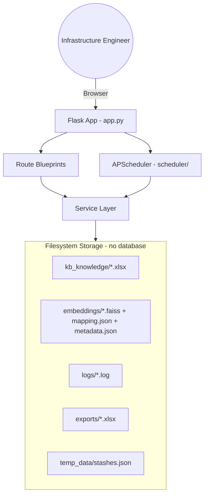
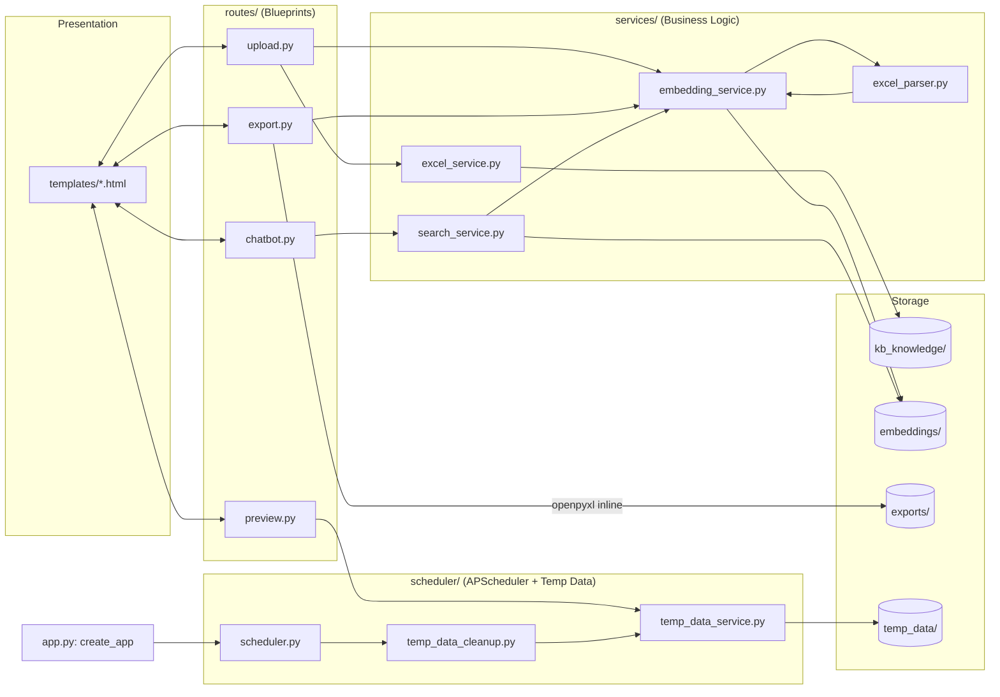
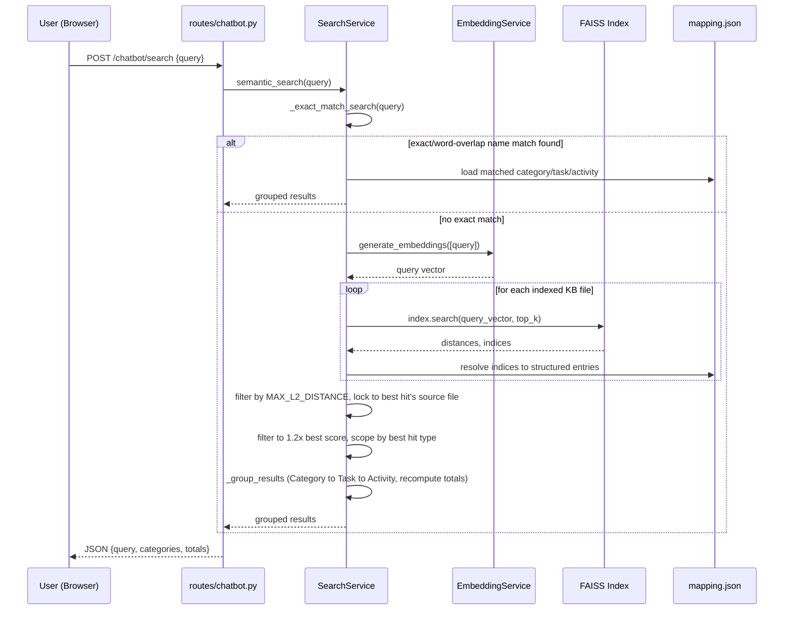
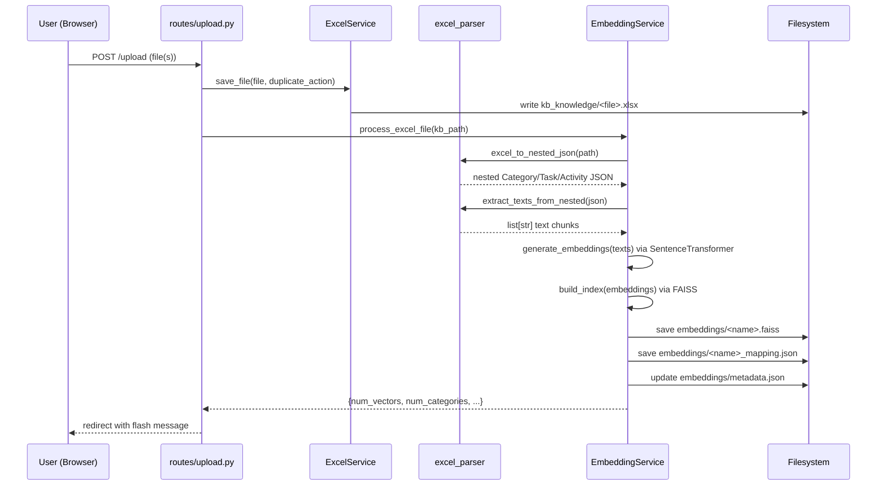
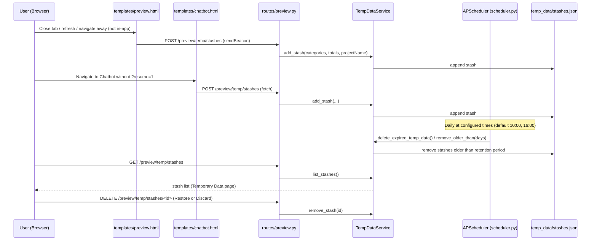

# MHES — Architecture

## 1. System Overview

MHES (Man Hour Estimation System) is a Flask web application that helps
Infrastructure Engineers estimate man-hours by searching a knowledge base of
Excel files using AI semantic search. There is no traditional database —
all state is persisted on the local filesystem (Excel files, FAISS vector
indices, and JSON metadata), including a lightweight in-process scheduler
for maintenance jobs.

Core capabilities:
- Upload `.xlsx` knowledge files (Category → Task → Activity man-hour breakdowns).
- Automatically convert each file into embeddings (Sentence Transformers + FAISS).
- Search the knowledge base via a chatbot-style semantic search interface.
- Assemble and edit estimates on a Preview screen, with results stashable as
  temporary data and restorable later.
- Export selected results to a formatted Excel workbook — and, when the
  export contains new Category/Task/Activity data, automatically add it to
  the knowledge base and embed it.
- Automatically purge old temporary data on a daily schedule (APScheduler).

## 2. Application Architecture

The app follows a **Flask application-factory + Blueprint + Service layer**
pattern, plus an in-process background scheduler:

- **`app.py`** — `create_app()` factory. Loads config, ensures required
  folders exist (including `temp_data/`), sets up logging, registers
  blueprints and error handlers, starts the APScheduler background
  scheduler (`scheduler.scheduler.init_scheduler`), and defines the `/`
  (chatbot landing page) and `/dashboard` routes.
- **`config.py`** — `Config` base class with `DevelopmentConfig`,
  `ProductionConfig`, `TestingConfig`. Defines folder paths (including
  `TEMP_DATA_FOLDER`), upload limits (`.xlsx` only, 10 MB max), embedding
  model name (`all-MiniLM-L6-v2`), Ollama settings (`OLLAMA_MODEL`,
  `OLLAMA_BASE_URL`), and temp-data cleanup settings
  (`TEMP_DATA_RETENTION_DAYS`, `TEMP_DATA_CLEANUP_TIMES`,
  `TEMP_DATA_TIMEZONE`).
- **`routes/`** — Thin Flask Blueprints; delegate all logic to `services/`
  (and, for Preview stashes, to `scheduler/`).
- **`services/`** — Business logic: Excel I/O, Excel parsing, embedding
  generation/indexing, semantic search.
- **`scheduler/`** — APScheduler integration and the temporary-data (Preview
  stash) store: scheduling, cleanup logic, and a manual CLI trigger. See
  §4 and §7.
- **`utils/`** — Cross-cutting helpers (logging setup, file utilities).
- **`templates/`** — Jinja2 views rendered server-side (Bootstrap 5 UI).

## 3. Frontend

Server-rendered Jinja2 templates styled with Bootstrap 5 and Bootstrap
Icons (CDN), Inter font (Google Fonts CDN). No JS build step or SPA
framework — interactivity is inline `<script>` blocks per page, using
`sessionStorage`/`localStorage` for client-side state (no cookies/session
framework in use).

- **`templates/base.html`** — Shared shell: collapsible sidebar navigation
  (AI Chatbot, Upload Files, Preview, Temporary Data — the last with a
  live badge showing the current stash count), CSS custom
  properties/theme, and a global click listener that marks in-app link
  navigation (`sessionStorage.mhes_internal_nav`) so pages can distinguish
  "navigated elsewhere in the app" from "closed/left the site" (see §7).
- **`templates/chatbot.html`** — Main semantic-search chat UI; posts
  queries to `/chatbot/search` and renders grouped Category → Task →
  Activity results. The conversation is persisted to `sessionStorage` and
  only resumed when arriving via `?resume=1` (set by Preview's "Add More /
  Back to Chatbot" link); any other entry path starts a fresh conversation
  and stashes pending Preview data server-side first (see §7).
- **`templates/upload.html`** — File upload UI (drag/drop multi-file),
  knowledge base file list with delete/re-embed actions and embedding
  status badges.
- **`templates/preview.html`** — Assembles and edits the Category → Task →
  Activity estimate hierarchy inline (add/delete/edit, live totals),
  exports to Excel, and stashes its data server-side on tab close/refresh
  via `pagehide` + `navigator.sendBeacon` (see §7).
- **`templates/temp_data.html`** — Lists server-side Preview stashes
  (`GET /preview/temp/stashes`), each with independent **Restore to
  Preview** and **Discard** actions.
- **`templates/dashboard.html`** — Summary stats (KB file count, embedded
  file count) shown via the `/dashboard` route.
- **`static/css`, `static/js`, `static/images`** — Present but currently
  empty placeholders (`.gitkeep` only); all styling/JS lives inline in
  templates today.

## 4. Backend

Flask Blueprints registered in `app.py::_register_blueprints`:

| Blueprint | Prefix | File | Responsibility |
|---|---|---|---|
| `upload_bp` | `/upload` | `routes/upload.py` | Upload `.xlsx` files, duplicate detection (rename/overwrite), auto-trigger embedding generation, delete/re-embed KB files |
| `chatbot_bp` | `/chatbot` | `routes/chatbot.py` | Render chatbot page; `/chatbot/search` runs semantic search |
| `preview_bp` | `/preview` | `routes/preview.py` | Render the Preview page and the Temporary Data page (`/preview/temp`); `GET/POST /preview/temp/stashes` and `DELETE /preview/temp/stashes/<id>` manage server-side Preview stashes via `scheduler.temp_data_service.TempDataService` |
| `export_bp` | `/export` | `routes/export.py` | `/export/excel` builds a styled `.xlsx` workbook from submitted category/task JSON via openpyxl and returns it as a download; if the submitted data contains a Category, Task, or Activity Detail not already in the knowledge base, it also builds a KB-ingestible workbook, saves it into `kb_knowledge/<project_name>.xlsx`, and embeds it via `EmbeddingService` |

Supporting services:

- **`services/excel_service.py`** (`ExcelService`) — Validates extensions,
  saves uploads into `kb_knowledge/` with duplicate-safe naming, lists and
  deletes KB files, reads a KB file into a DataFrame.
- **`services/excel_parser.py`** — `excel_to_nested_json()` parses an Excel
  file (all sheets) with flexible column matching (`Category`, `Task`,
  `Detail`/`Activity`, `Estimate`, `Buffer`) into a nested
  Category → Task → Activity structure, forward-filling merged cells and
  generating rich natural-language `text` fields per level for embedding.
  `extract_texts_from_nested()` flattens all `text` fields for the
  embedding pipeline.
- **`services/search_service.py`** (`SearchService`) — See §6; matches by
  exact/partial name first (now including word-level compound scoping,
  e.g. "wordpress documentation" scopes to the "Wordpress" category from a
  single shared word), falling back to FAISS semantic search scoped to the
  best-matching file's source.
- **`services/export_service.py`** — Stub class (`NotImplementedError`
  methods); the actual export logic used by the app lives inline in
  `routes/export.py` (`_build_workbook` for the download,
  `_build_kb_ingest_workbook` for the auto-added KB copy).
- **`utils/logger.py`** — Configures a rotating file handler
  (`logs/mhes.log`, 5 MB × 5 backups) plus console logging.
- **`utils/file_utils.py`** — Small filename/extension/size helpers.

Scheduler package (new):

- **`scheduler/scheduler.py`** (`init_scheduler`) — Creates and starts an
  APScheduler `BackgroundScheduler` (timezone-aware, default
  `Asia/Yangon`), registering one cron job per configured time in
  `TEMP_DATA_CLEANUP_TIMES` (default `10:00` and `16:00`) that calls
  `delete_expired_temp_data`. Idempotent (safe against Flask's debug-mode
  reloader and repeated calls) via stable job IDs and a module-level guard.
- **`scheduler/temp_data_cleanup.py`** (`delete_expired_temp_data`) — The
  single reusable cleanup function, used by both the scheduled job and the
  manual CLI script; logs start/finish and every deleted stash.
- **`scheduler/temp_data_service.py`** (`TempDataService`) — Reads/writes
  `temp_data/stashes.json`: `list_stashes`, `add_stash`, `remove_stash`,
  `remove_older_than`. Shared by everyone using the app (no per-user
  scoping — MHES has no authentication system).
- **`scheduler/cleanup_temp_data.py`** — Standalone CLI for forcing an
  out-of-band cleanup run outside the schedule (e.g. for verification).

## 5. Database

**There is no database.** All persistence is filesystem-based:

- `kb_knowledge/*.xlsx` — knowledge base source files. Normally
  user-uploaded, but can also be written automatically by
  `routes/export.py` when an exported project contains new knowledge (see
  §4); either way, once present it's treated as a source of truth for
  embedding.
- `embeddings/metadata.json` — central registry keyed by filename, tracking
  categories, vector counts, embedding dimension, index/mapping paths, and
  embedded-at timestamp for every processed file.
- `embeddings/<name>.faiss` — one FAISS `IndexFlatL2` vector index per
  knowledge file.
- `embeddings/<name>_mapping.json` — the nested Category → Task → Activity
  JSON for that file, used to resolve FAISS hit indices back to structured,
  human-readable data.
- `temp_data/stashes.json` — flat JSON array of Preview stashes (see §7),
  managed by `scheduler/temp_data_service.py`.
- `uploads/`, `exports/`, `logs/` — working folders for temp uploads,
  generated export workbooks, and rotating log files.

`app.py::_ensure_folders` creates all of these directories (including
`temp_data/`) on startup if missing.

## 6. AI Chatbot Flow

The chatbot performs retrieval-based semantic search (no generative LLM
call is currently wired in, despite `OLLAMA_MODEL`/`OLLAMA_BASE_URL` being
present in `config.py`).

**Indexing (on upload/re-embed, or on export auto-add), via
`EmbeddingService.process_excel_file`:**
1. `excel_parser.excel_to_nested_json()` converts the Excel file into a
   Category → Task → Activity JSON with generated `text` descriptions.
2. `excel_parser.extract_texts_from_nested()` collects every `text` field
   as an embedding chunk.
3. `EmbeddingService.generate_embeddings()` encodes the texts with
   `SentenceTransformer("all-MiniLM-L6-v2")`.
4. `EmbeddingService.build_index()` builds a FAISS `IndexFlatL2` and
   `save_index()` writes it to `embeddings/<name>.faiss`.
5. The nested JSON is saved as `embeddings/<name>_mapping.json`.
6. `embeddings/metadata.json` is updated with per-file stats.

**Query (on `/chatbot/search`), via `SearchService.semantic_search`:**
1. **Exact match phase** (`_exact_match_search`) — checks (case-insensitively,
   tiered exact / contains / contained-by) whether the query names a known
   Category, Task, or Activity. Compound scoping now matches on any
   meaningful **shared word** with a category name (not just the full name
   as a contiguous substring), so a partial query like "wordpress
   documentation" scopes to the "Wordpress" category before matching
   "Documentation" as a task within it. Detail-level matches win over
   task-level when strictly more specific.
2. **Fallback semantic phase** — if no exact match, the query is embedded
   and searched against every file's FAISS index; hits beyond
   `MAX_L2_DISTANCE = 1.4` are discarded, then results are restricted to
   the same `source` file as the best-scoring hit (preventing results from
   mixing unrelated KB files), then further filtered to within `1.2×` the
   best score, and scoped to the best hit's level (activity/task).
3. **Grouping** (`_group_results`) — matched hits are grouped back into
   Category → Task → Activity, with task-level totals (estimate, buffer,
   final) recomputed to reflect only the displayed activities.
4. The route returns JSON (`{query, categories, totals}`) which the
   `chatbot.html` template renders as a structured result table.

## 7. Scheduler & Temporary Data (Preview Stashing)

Preview data (the in-progress Category → Task → Activity estimate a user
is assembling) normally lives only in the browser's `sessionStorage`. To
avoid losing it, the app can **stash** a snapshot to the server
(`temp_data/stashes.json`) at several points, and **restore** it later from
the Temporary Data page — with old stashes automatically purged on a
schedule.

**Stash triggers:**
- Navigating to the Chatbot in any way other than "Add More / Back to
  Chatbot" (i.e. without `?resume=1`) — handled in `templates/chatbot.html`.
- Closing the tab/browser, refreshing, or navigating to a URL outside the
  app while Preview has data — handled in `templates/preview.html` via the
  `pagehide` event and `navigator.sendBeacon` (chosen because it reliably
  fires mid-unload, unlike a normal `fetch`). Normal in-app link clicks are
  excluded via the `mhes_internal_nav` flag set in `templates/base.html`,
  since Preview data already persists safely across in-app navigation.

**Storage and lifecycle**, via `POST/GET/DELETE /preview/temp/stashes`
(`routes/preview.py` → `scheduler.temp_data_service.TempDataService`):
- Each stash is a JSON record: `id`, `stashedAt`, `projectName`,
  `categories`, `totals`.
- `templates/temp_data.html` lists all stashes; **Restore to Preview**
  merges one stash's categories back into the active `previewData` (by
  category+source, same rule used when adding chatbot results) and deletes
  the stash; **Discard** just deletes it.

**Scheduled cleanup**, via `scheduler/scheduler.py` + `temp_data_cleanup.py`:
- `init_scheduler(app)` is called once from `app.py::create_app()` and
  starts an APScheduler `BackgroundScheduler` in-process — it only runs
  while the Flask app is running; no OS-level Task Scheduler/cron job is
  used.
- Cron-triggered daily at each time in `TEMP_DATA_CLEANUP_TIMES` (default
  `10:00` and `16:00`, timezone `TEMP_DATA_TIMEZONE`, default
  `Asia/Yangon`), it calls `delete_expired_temp_data()`, which removes
  stashes older than `TEMP_DATA_RETENTION_DAYS` (default 7).
- `scheduler/cleanup_temp_data.py` provides the same cleanup as a one-off
  CLI command, independent of the scheduler.

