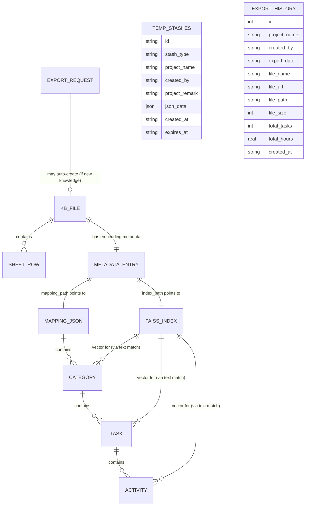

# MHES — Database

## Overview

MHES does **not use a relational database for its Knowledge Base or
embeddings data** — those are still filesystem-based, using `.xlsx`
files, JSON files, and FAISS binary index files as the "tables" (see §2–§6
below).

However, MHES **does** use a real SQLite database, `database/mhes.db`,
as the backing store for two features: **Preview Temporary Data stashes**
(§7) and **Export History** (§8). This is a plain `sqlite3` connection
(WAL mode) opened via `database/db.py` — there is no ORM/SQLAlchemy model,
just raw SQL executed from `repositories/temp_repository.py` and
`services/export_history_service.py`. Both tables are created
automatically (`CREATE TABLE IF NOT EXISTS`) the first time the app
starts.

These two SQLite tables replace an older, filesystem-only design: Preview
stashes previously lived only in `temp_data/stashes.json`, and export
metadata was previously scattered across per-feature databases
(`temp_data/temp_storage.db`, `exports/export_history.db`). On startup,
`app.py` runs two idempotent one-shot migrations (`utils/migration.py`)
that import any legacy `stashes.json` records and merge rows from those
older per-feature databases into the single shared `mhes.db`; the old
files are left on disk untouched, but are no longer read by the running
application.

The sections below document both the file-based stores and the SQLite
tables — their schema (columns/fields), relationships, and purpose —
based on the actual read/write code in `services/excel_service.py`,
`services/excel_parser.py`, `services/embedding_service.py`,
`routes/export.py`, `database/db.py`, `repositories/temp_repository.py`,
`scheduler/temp_data_service.py`, and `services/export_history_service.py`.

`TEMP_STASHES` and `EXPORT_HISTORY` (both stored in `database/mhes.db`)
are intentionally **not** connected to the KB/embeddings chain above —
neither has a foreign-key relationship to any KB file; each is an
independent SQLite table keyed only by its own primary key.

## 1. "Tables" (Filesystem Stores and SQLite Tables)

| Store | Location | Format | Written by | Read by |
|---|---|---|---|---|
| Knowledge Base File | `kb_knowledge/<filename>.xlsx` | Excel workbook | `ExcelService.save_file` (manual upload), or `routes/export.py::_build_kb_ingest_workbook` (auto-added on export) | `ExcelService.read_excel`, `excel_parser.excel_to_nested_json` |
| Embeddings Metadata | `embeddings/metadata.json` | JSON (dict keyed by filename) | `EmbeddingService._save_metadata` | `EmbeddingService.get_file_metadata`, `has_index`, `SearchService` |
| FAISS Vector Index | `embeddings/<index_name>.faiss` | FAISS binary index | `EmbeddingService.save_index` | `EmbeddingService.load_index`, `SearchService.semantic_search` |
| Mapping JSON | `embeddings/<index_name>_mapping.json` | JSON (nested list) | `EmbeddingService.process_excel_file` | `SearchService` (all match/grouping functions), `routes/export.py` (existing-knowledge check) |
| Export Workbook | `exports/<project>_manhour.xlsx` | Excel workbook | `routes/export.py::_build_workbook` | downloaded by user (write-once, not re-read) |
| Temp Data Store | SQLite table `temp_stashes` in `database/mhes.db` | SQLite table | `TempRepository.insert` / `delete` / `delete_older_than` (via `TempDataService`) | `TempDataService.list_stashes` / `list_stashes_page` / `get_by_key`, `routes/preview.py`, `scheduler/temp_data_cleanup.py` |
| Export History | SQLite table `export_history` in `database/mhes.db` | SQLite table | `ExportHistoryService.insert_history` (from `routes/export.py`) | `ExportHistoryService.get_history` / `get_history_page` / `get_history_by_file_name`, `routes/export.py` |

`index_name` = the KB filename without its `.xlsx` extension
(`os.path.splitext(filename)[0]`), so each KB file maps 1:1 to one
`.faiss` file and one `_mapping.json` file.

> **Note:** `temp_data/stashes.json` and the legacy per-feature databases
> (`temp_data/temp_storage.db`, `exports/export_history.db`) may still be
> present on disk from before the SQLite migration, but are no longer read
> by the running application except once, at startup, by the one-shot
> migration in `utils/migration.py` (see Overview above and §7/§8 below).

---

## 2. Table: Knowledge Base File (source Excel, `kb_knowledge/*.xlsx`)

**Purpose:** Man-hour breakdown data that gets embedded and searched. It
is never modified by the app once written (`embedding_service.py`
docstring: "The original Excel file is never modified"), regardless of how
it got there.

**Written two ways:**
1. **Manual upload** — `ExcelService.save_file` (via `routes/upload.py`);
   the source of truth for hand-maintained knowledge.
2. **Automatic, from Export** — `routes/export.py::export_excel` checks
   whether the exported project contains any Category, Task, or Activity
   Detail not already present in any embedded KB file (via
   `_load_existing_kb_index` / `_has_new_items`, which scan every mapping
   JSON in `embeddings/metadata.json`). If so, it writes a second workbook,
   named `<project_name>.xlsx` (collision-safe via
   `_unique_kb_filename`, which appends a timestamp), and immediately
   embeds it — feeding the export flow back into the searchable knowledge
   base. This is best-effort: failures here are logged and never block the
   actual Excel download.

**Columns** (matched flexibly by `excel_parser._map_columns` via
substring matching on header names, case-insensitive):

| Logical Column | Header keywords matched | Type | Notes |
|---|---|---|---|
| `category` | contains "category" or "project" | string | Forward-filled to handle merged cells |
| `task` | contains "task" (and not "detail") | string | Forward-filled to handle merged cells |
| `detail` | contains "detail" or "activity" | string | Required; rows without it are skipped |
| `estimate` | contains "estimate", or contains "hour" and not "buffer" | float | Coerced via `_safe_float` (NaN → 0.0) |
| `buffer` | contains "buffer" | float | Optional; if present, taken as the task-level buffer |

A workbook may contain multiple sheets; **all sheets are read** and merged
into one combined result (`pd.read_excel(..., sheet_name=None)`). The
auto-generated workbook from the export flow uses this exact same column
layout (`Category`, `Task List`, `Activity Details`, `Estimate (Hours)`,
`Buffer (Hours)`, one row per Activity Detail), so it parses identically
to a manually-uploaded file.

**Note:** Category names are **not unique across files** — the same
category name (e.g. a project reused as a template) can legitimately exist
in more than one KB file/mapping JSON. Nothing enforces uniqueness; this
is expected, and `SearchService` already scopes semantic-search results to
a single source file to avoid mixing results across duplicates.

---

## 3. Table: Embeddings Metadata (`embeddings/metadata.json`)

**Purpose:** Central registry of which KB files have been embedded, so the
app never needs to scan the filesystem to know embedding status. Acts as
the closest thing to an index/catalog table.

**Schema** — top-level dict keyed by `filename`; each value is a record:

| Column | Type | Description |
|---|---|---|
| `filename` | string | KB Excel filename (primary key, duplicated as a field) |
| `categories` | list[string] | Names of top-level categories found in the file |
| `num_categories` | int | Count of categories |
| `num_vectors` | int | Count of embedded text chunks (category + task + activity levels) |
| `dimension` | int | Embedding vector dimensionality (model-dependent) |
| `index_path` | string | Absolute path to the file's `.faiss` index |
| `mapping_path` | string | Absolute path to the file's `_mapping.json` |
| `embedded_at` | string (ISO datetime) | Timestamp of last embedding generation |

**Relationships:** One record per KB file (1:1 with `kb_knowledge/*.xlsx`
by filename). `index_path` and `mapping_path` are foreign-key-like
pointers to the FAISS index and mapping JSON described below. Populated
identically whether the source `.xlsx` came from a manual upload or the
export flow's auto-add.

---

## 4. Table: FAISS Vector Index (`embeddings/<name>.faiss`)

**Purpose:** Enables nearest-neighbor semantic search. Stores one
embedding vector per text chunk (built with `IndexFlatL2`, i.e. exact L2
distance search, no approximation).

**"Columns":** A FAISS `IndexFlatL2` has no named fields — it stores raw
float32 vectors indexed by **position (0-based integer)**. There is no
explicit ID column; the vector's position in the index corresponds to the
same position in the ordered list produced by
`excel_parser.extract_texts_from_nested()` at embedding time.

**Relationships:** Resolved back to structured data at query time in
`SearchService.semantic_search`:
1. `extract_texts_from_nested(mapping_json)` reproduces the same ordered
   text list used at index-build time.
2. `_build_text_to_id(mapping_json)` maps each `text` string to its entry
   `id`.
3. `_build_id_lookup(mapping_json, filename)` maps each `id` to its full
   structured record (category/task/activity).

So the join path is: **FAISS position → text (by position) → id (by text)
→ structured record (by id)**. There is no stored numeric key linking a
vector directly to a mapping entry; the link is reconstructed from the
text content on every search. After the exact-match/word-overlap phase,
semantic-search hits are also filtered down to a single `source` file (the
best-scoring hit's file) before being grouped, so results never mix rows
from two different KB files.

---

## 5. Table: Mapping JSON (`embeddings/<name>_mapping.json`)

**Purpose:** The structured, hierarchical representation of a KB file
(Category → Task → Activity), used both to resolve search hits and to
render/aggregate results. This is the "real" relational data — expressed
as nested JSON instead of normalized SQL tables.

### 5.1 Category (top-level array elements)

| Column | Type | Description |
|---|---|---|
| `id` | string | Slug-based ID, e.g. `<category-slug>_summary` |
| `type` | string | Always `"category_summary"` |
| `category` | string | Category display name |
| `task_count` | int | Number of tasks in this category |
| `total_estimate_hours` | float | Sum of all task estimate hours |
| `total_buffer_hours` | float | Sum of all task buffer hours |
| `grand_total_hours` | float | `total_estimate_hours + total_buffer_hours` |
| `tasks` | list[Task] | Child records (see below) |
| `text` | string | Generated natural-language summary used as an embedding chunk |

### 5.2 Task (`category.tasks[]`)

| Column | Type | Description |
|---|---|---|
| `id` | string | Slug-based ID, e.g. `<cat-slug>_<task-slug>_summary` |
| `task` | string | Task display name |
| `estimate_hours` | float | Sum of activity estimate hours |
| `buffer_hours` | float | Task-level buffer (from the Excel `buffer` column) |
| `total_hours` | float | `estimate_hours + buffer_hours` |
| `task_details` | list[Activity] | Child records (see below) |
| `text` | string | Generated natural-language summary used as an embedding chunk |

**Foreign key (implicit):** belongs to exactly one Category (parent by
array nesting, not a stored key).

### 5.3 Activity (`task.task_details[]`)

| Column | Type | Description |
|---|---|---|
| `id` | string | Slug-based ID, e.g. `<cat-slug>_<task-slug>_<detail-slug>` |
| `task_detail` | string | Activity display name (from the Excel `detail` column) |
| `estimate_hours` | float | From the Excel `estimate` column |
| `buffer_scope` | string | Always `"task-level"` |
| `buffer_note` | string | Explanatory text on how buffer applies (task-level vs standalone) |
| `standalone_buffer_hours` | float | Fixed constant `0.5` |
| `text` | string | Generated natural-language description used as an embedding chunk |

**Foreign key (implicit):** belongs to exactly one Task (parent by array
nesting).

**Relationships summary (Category 1—N Task 1—N Activity):**
- One Category has many Tasks.
- One Task has many Activities.
- IDs are derived by slugifying and concatenating parent names
  (`<category-slug>_<task-slug>_<detail-slug>`), so hierarchy is encoded
  in the ID string itself rather than a separate foreign-key field.

---

## 6. Table: Export Workbook (`exports/<project>_manhour.xlsx`)

**Purpose:** Output-only artifact generated on demand by
`routes/export.py::_build_workbook` from the same Category → Task
structure (columns: `Category`, `Task List`, `Estimate (Hours)`,
`Working Day`). Not read back by the application — it exists purely as a
downloadable deliverable for the user.

**This workbook itself is still not part of the query/search data
model** — but as of the export flow's auto-add feature (see §2), the same
export request may *also* produce a second, differently-formatted
workbook under `kb_knowledge/` that **is** part of the search index. The
two are separate files with separate schemas; only the `kb_knowledge/`
copy is ever read back.

---

## 7. Table: Temp Data Store (SQLite table `temp_stashes`, in `database/mhes.db`)

**Purpose:** Server-side backup of in-progress Preview data (Category →
Task → Activity being assembled, before export), so it survives closing
the browser — the active copy otherwise lives only in the browser's
`sessionStorage`. Managed entirely by `repositories/temp_repository.py`
(`TempRepository`, raw SQL only) via `scheduler/temp_data_service.py`
(`TempDataService`, business logic), and exposed via `routes/preview.py`
(`GET`/`POST /preview/temp/stashes`, `DELETE /preview/temp/stashes/<id>`).
Shared by everyone using the app — there is no per-user scoping, since
MHES has no authentication system.

**Schema** — one row per stash, table `temp_stashes`:

| Column | Type | Description |
|---|---|---|
| `id` | TEXT (primary key) | `uuid.uuid4().hex` |
| `stash_type` | TEXT | Always `"preview"` for Preview stashes (reserved for future stash types) |
| `project_name` | TEXT | Project name from Preview at the time of stashing (may be empty) |
| `created_by` | TEXT | "Created By" value from Preview at the time of stashing (may be empty) |
| `project_remark` | TEXT | Project Remark HTML from Preview at the time of stashing (may be empty) |
| `json_data` | TEXT (JSON) | `{"categories": [...], "totals": {...}}` — same Category → Task → Activity shape used on the Preview screen (not the Mapping JSON shape in §5 — no `id`/`text` fields, just `category`, `source`, `tasks[].task/estimate_hours/buffer_hours/total_hours/activities[].task_detail/estimate_hours`) |
| `created_at` | TEXT (ISO datetime, naive/local) | `datetime.now().isoformat()` at stash time; also the basis for expiry |
| `expires_at` | TEXT (ISO datetime), nullable | Currently always `NULL` for Preview stashes; expiry is instead computed from `created_at` + retention days (see Lifecycle below) |

Indexed on `expires_at` and `stash_type` (`idx_temp_stashes_expires_at`,
`idx_temp_stashes_stash_type`) for the scheduled cleanup query and
type-filtered listing.

**Relationships:** None to the KB/embeddings tables above — a stash is a
self-contained snapshot, not a reference to any KB file (even though its
`json_data.categories[].source` field may happen to name one).

**Lifecycle:**
- **Created** by `TempDataService.add_stash`, triggered from the frontend
  when: (a) navigating to the Chatbot other than via "Add More / Back to
  Chatbot", or (b) the Preview tab is closed/refreshed/navigated away from
  outside the app while it has data (via `pagehide` + `sendBeacon`).
- **Removed individually** by `TempDataService.remove_stash`, on
  **Restore to Preview** (merges the stash back into the active
  `previewData` client-side, then deletes it) or **Discard**, both from
  `templates/temp_data.html`.
- **Removed by age** by `TempDataService.remove_older_than(days)`, called
  by `scheduler/temp_data_cleanup.py::delete_expired_temp_data`, which runs
  on an APScheduler cron schedule (`scheduler/scheduler.py`, default times
  configured by `Config.TEMP_DATA_CLEANUP_TIMES`, `Asia/Yangon` timezone)
  and is also invokable manually via `scheduler/cleanup_temp_data.py`.
  Retention is configured by `Config.TEMP_DATA_RETENTION_DAYS` (default 7
  days), compared against `created_at`.

**Migration note:** This table supersedes the older `temp_data/stashes.json`
flat-file store (and an even-older per-feature `temp_data/temp_storage.db`).
On startup, `utils/migration.py::migrate_stashes_json_to_sqlite` and
`merge_legacy_databases_into_mhes` import any existing legacy records into
`temp_stashes` exactly once (tracked via a `db_migrations` table in
`database/db.py`, so re-running on every startup is a safe no-op). The
legacy files are left on disk but are no longer read by the running app.

---

## 8. Table: Export History (SQLite table `export_history`, in `database/mhes.db`)

**Purpose:** Metadata registry of every generated Excel export, so the
Export History / Exported Files page can be rendered from a fast indexed
lookup instead of re-scanning and re-reading every Excel file on every
page load. Managed entirely by `services/export_history_service.py`
(`ExportHistoryService`, raw SQL only) and written to from
`routes/export.py` immediately after a new export is generated. The
actual Excel files themselves are untouched by this service — it only
records where a file is and what it contains.

**Schema** — one row per export, table `export_history`:

| Column | Type | Description |
|---|---|---|
| `id` | INTEGER (primary key, autoincrement) | Row id |
| `project_name` | TEXT | Project name entered on Preview at export time |
| `created_by` | TEXT | "Created By" value entered on Preview at export time |
| `export_date` | TEXT | When the export was generated (ISO datetime string) |
| `file_name` | TEXT (not null) | Name of the generated Excel file as saved/uploaded |
| `file_url` | TEXT | URL used to download the file |
| `file_path` | TEXT, nullable | Where the file actually lives: a GCS object path (`mhes/bcmm/1001/...`) for exports created after the Google Cloud Storage migration, or a local absolute path for older records (see `docs/ARCHITECTURE.md` §5a) |
| `file_size` | INTEGER | Size of the generated file, in bytes |
| `total_tasks` | INTEGER | Total number of tasks across all categories in the export |
| `total_hours` | REAL | Total estimated hours across all tasks in the export |
| `created_at` | TEXT (ISO datetime) | Record creation timestamp; used for sorting/pagination |

Indexed on `created_at` and `file_name` (`idx_export_history_created_at`,
`idx_export_history_file_name`) for the Exported Files list's sort order
and the download/view routes' filename lookup.

**Relationships:** None to the KB/embeddings tables above. Loosely related
to `kb_knowledge/*.xlsx` only in the sense that an export **may** also
trigger a separate, unrelated write into the Knowledge Base (see §2) —
there is no stored foreign key between the two.

**Lifecycle:**
- **Created** by `ExportHistoryService.insert_history`, called from
  `routes/export.py::export_excel` right after a workbook is built and
  uploaded to Google Cloud Storage (or, for pre-migration records,
  written locally).
- **Updated** by `ExportHistoryService.update_file_path`, used only by
  `utils/migrate_exports_to_gcs.py` to repoint a pre-migration record at
  its new GCS object path once the underlying file has been uploaded.
- **Read** by the Exported Files list (`get_history_page`, with
  date-range/project-name filtering and pagination applied in SQL) and by
  the download/view routes (`get_history_by_file_name`) to resolve a
  filename from the URL back to its stored `file_path`.
- **Deleted** by `ExportHistoryService.delete_history` (removes only the
  metadata row; never touches the underlying Excel file).

**Migration note:** This table supersedes an older, separate
`exports/export_history.db` file. `utils/migration.py::merge_legacy_databases_into_mhes`
imports any rows from that legacy database into `export_history` exactly
once at startup, the same way it does for Temp Data (see §7).

---

## 9. Referential Integrity Notes

- There are no database-level constraints (no foreign keys, no
  transactions). Consistency between `kb_knowledge/*.xlsx`,
  `embeddings/metadata.json`, `embeddings/*.faiss`, and
  `embeddings/*_mapping.json` is maintained purely by application logic:
  - `EmbeddingService.process_excel_file` writes all three embedding
    artifacts (index, mapping, metadata entry) together — whether called
    from `routes/upload.py` (manual upload) or `routes/export.py`
    (auto-add on export).
  - `EmbeddingService.delete_index` removes the `.faiss` file, the
    `_mapping.json` file, and the `metadata.json` entry together.
  - `routes/upload.py::delete_file` calls `emb.delete_index()` before
    `svc.delete_file()`, keeping the Excel file and its embeddings in
    sync.
- If a KB `.xlsx` file is deleted without going through the app (e.g.
  manually from disk), its `metadata.json` entry and FAISS/mapping files
  would become orphaned — no code currently detects or cleans up this
  case.
- The Temp Data Store (`temp_stashes` table) and Export History
  (`export_history` table) are both fully independent of the KB/embeddings
  files — deleting a KB file has no effect on any existing stash or export
  history record, and vice versa. Both live in the same shared SQLite
  database, `database/mhes.db` (`database/db.py`), opened in WAL mode with
  a 30-second busy timeout, which lets Flask's request-handling threads,
  the APScheduler background thread, and standalone CLI scripts
  (`scheduler/cleanup_temp_data.py`, `utils/migrate_exports_to_gcs.py`)
  safely share the same file concurrently — unlike the old flat-JSON
  design, writes are now transactional per-statement rather than
  read-modify-write of an entire file.
- There are still no foreign-key constraints between `temp_stashes` and
  `export_history`, or between either of them and the KB/embeddings files;
  each table's consistency is self-contained.
- A `db_migrations` table (in `database/db.py`) tracks which one-shot
  migrations have already run (`stashes_json_to_sqlite_v1`,
  `merge_legacy_dbs_into_mhes_v1`), so the legacy-import logic in
  `utils/migration.py` is safe to invoke on every application startup
  without re-importing or duplicating rows.
