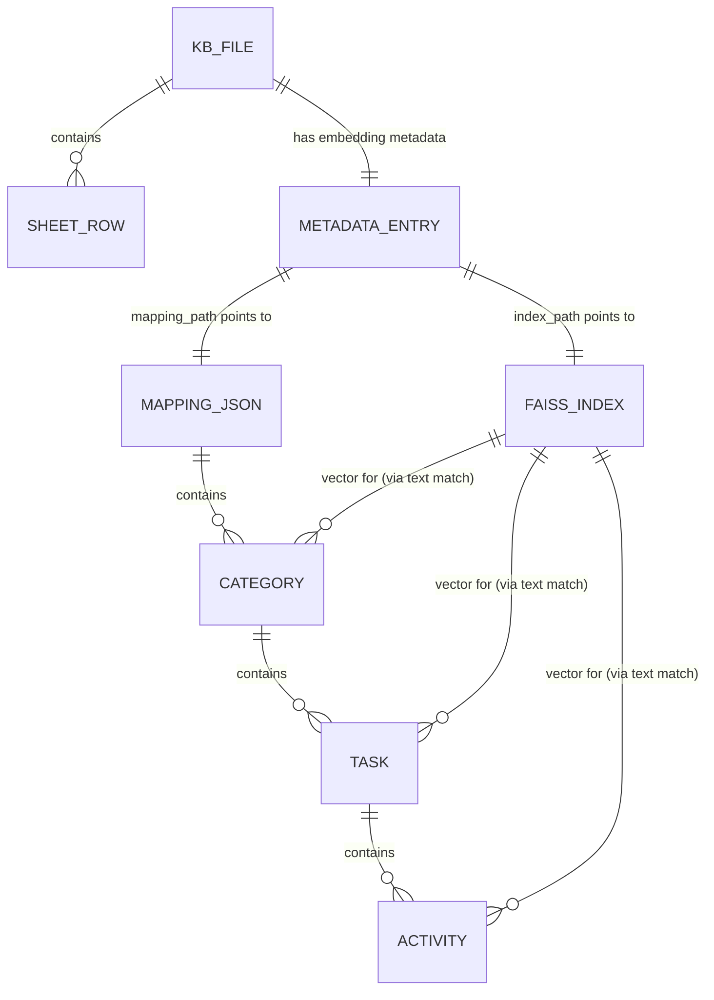

# MHES — Database

## Overview

MHES does **not use a relational or NoSQL database engine**. There is no
SQLAlchemy model, no `.db` file, and no ORM anywhere in the codebase
(confirmed by inspecting `app.py`, `config.py`, and all of `services/`).
Persistence is implemented entirely with the **local filesystem**, using
`.xlsx` files, JSON files, and FAISS binary index files as the "tables."

The sections below document these file-based stores as if they were
tables — their schema (columns/fields), relationships, and purpose — based
on the actual read/write code in `services/excel_service.py`,
`services/excel_parser.py`, and `services/embedding_service.py`.

## 1. "Tables" (Filesystem Stores)

| Store | Location | Format | Written by | Read by |
|---|---|---|---|---|
| Knowledge Base File | `kb_knowledge/<filename>.xlsx` | Excel workbook | `ExcelService.save_file` | `ExcelService.read_excel`, `excel_parser.excel_to_nested_json` |
| Embeddings Metadata | `embeddings/metadata.json` | JSON (dict keyed by filename) | `EmbeddingService._save_metadata` | `EmbeddingService.get_file_metadata`, `has_index`, `SearchService` |
| FAISS Vector Index | `embeddings/<index_name>.faiss` | FAISS binary index | `EmbeddingService.save_index` | `EmbeddingService.load_index`, `SearchService.semantic_search` |
| Mapping JSON | `embeddings/<index_name>_mapping.json` | JSON (nested list) | `EmbeddingService.process_excel_file` | `SearchService` (all match/grouping functions) |
| Export Workbook | `exports/<project>_manhour.xlsx` | Excel workbook | `routes/export.py::_build_workbook` | downloaded by user (write-once, not re-read) |

`index_name` = the KB filename without its `.xlsx` extension
(`os.path.splitext(filename)[0]`), so each KB file maps 1:1 to one
`.faiss` file and one `_mapping.json` file.

---

## 2. Table: Knowledge Base File (source Excel, `kb_knowledge/*.xlsx`)

**Purpose:** Raw, user-uploaded man-hour breakdown data. This is the
source of truth; it is never modified by the app after upload
(`embedding_service.py` docstring: "The original Excel file is never
modified").

**Columns** (matched flexibly by `excel_parser._map_columns` via
substring matching on header names, case-insensitive):

| Logical Column | Header keywords matched | Type | Notes |
|---|---|---|---|
| `category` | contains "category" or "project" | string | Forward-filled to handle merged cells |
| `task` | contains "task" (and not "detail") | string | Forward-filled to handle merged cells |
| `detail` | contains "detail" or "activity" | string | Required; rows without it are skipped |
| `estimate` | contains "estimate", or contains "hour" and not "buffer" | float | Coerced via `_safe_float` (NaN → 0.0) |
| `buffer` | contains "buffer" | float | Optional; if present, taken as the task-level buffer |

A workbook may contain multiple sheets; **all sheets are read** and merged
into one combined result (`pd.read_excel(..., sheet_name=None)`).

---

## 3. Table: Embeddings Metadata (`embeddings/metadata.json`)

**Purpose:** Central registry of which KB files have been embedded, so the
app never needs to scan the filesystem to know embedding status. Acts as
the closest thing to an index/catalog table.

**Schema** — top-level dict keyed by `filename`; each value is a record:

| Column | Type | Description |
|---|---|---|
| `filename` | string | KB Excel filename (primary key, duplicated as a field) |
| `categories` | list[string] | Names of top-level categories found in the file |
| `num_categories` | int | Count of categories |
| `num_vectors` | int | Count of embedded text chunks (category + task + activity levels) |
| `dimension` | int | Embedding vector dimensionality (model-dependent) |
| `index_path` | string | Absolute path to the file's `.faiss` index |
| `mapping_path` | string | Absolute path to the file's `_mapping.json` |
| `embedded_at` | string (ISO datetime) | Timestamp of last embedding generation |

**Relationships:** One record per KB file (1:1 with `kb_knowledge/*.xlsx`
by filename). `index_path` and `mapping_path` are foreign-key-like
pointers to the FAISS index and mapping JSON described below.

---

## 4. Table: FAISS Vector Index (`embeddings/<name>.faiss`)

**Purpose:** Enables nearest-neighbor semantic search. Stores one
embedding vector per text chunk (built with `IndexFlatL2`, i.e. exact L2
distance search, no approximation).

**"Columns":** A FAISS `IndexFlatL2` has no named fields — it stores raw
float32 vectors indexed by **position (0-based integer)**. There is no
explicit ID column; the vector's position in the index corresponds to the
same position in the ordered list produced by
`excel_parser.extract_texts_from_nested()` at embedding time.

**Relationships:** Resolved back to structured data at query time in
`SearchService.semantic_search`:
1. `extract_texts_from_nested(mapping_json)` reproduces the same ordered
   text list used at index-build time.
2. `_build_text_to_id(mapping_json)` maps each `text` string to its entry
   `id`.
3. `_build_id_lookup(mapping_json, filename)` maps each `id` to its full
   structured record (category/task/activity).

So the join path is: **FAISS position → text (by position) → id (by text)
→ structured record (by id)**. There is no stored numeric key linking a
vector directly to a mapping entry; the link is reconstructed from the
text content on every search.

---

## 5. Table: Mapping JSON (`embeddings/<name>_mapping.json`)

**Purpose:** The structured, hierarchical representation of a KB file
(Category → Task → Activity), used both to resolve search hits and to
render/aggregate results. This is the "real" relational data — expressed
as nested JSON instead of normalized SQL tables.

### 5.1 Category (top-level array elements)

| Column | Type | Description |
|---|---|---|
| `id` | string | Slug-based ID, e.g. `<category-slug>_summary` |
| `type` | string | Always `"category_summary"` |
| `category` | string | Category display name |
| `task_count` | int | Number of tasks in this category |
| `total_estimate_hours` | float | Sum of all task estimate hours |
| `total_buffer_hours` | float | Sum of all task buffer hours |
| `grand_total_hours` | float | `total_estimate_hours + total_buffer_hours` |
| `tasks` | list[Task] | Child records (see below) |
| `text` | string | Generated natural-language summary used as an embedding chunk |

### 5.2 Task (`category.tasks[]`)

| Column | Type | Description |
|---|---|---|
| `id` | string | Slug-based ID, e.g. `<cat-slug>_<task-slug>_summary` |
| `task` | string | Task display name |
| `estimate_hours` | float | Sum of activity estimate hours |
| `buffer_hours` | float | Task-level buffer (from the Excel `buffer` column) |
| `total_hours` | float | `estimate_hours + buffer_hours` |
| `task_details` | list[Activity] | Child records (see below) |
| `text` | string | Generated natural-language summary used as an embedding chunk |

**Foreign key (implicit):** belongs to exactly one Category (parent by
array nesting, not a stored key).

### 5.3 Activity (`task.task_details[]`)

| Column | Type | Description |
|---|---|---|
| `id` | string | Slug-based ID, e.g. `<cat-slug>_<task-slug>_<detail-slug>` |
| `task_detail` | string | Activity display name (from the Excel `detail` column) |
| `estimate_hours` | float | From the Excel `estimate` column |
| `buffer_scope` | string | Always `"task-level"` |
| `buffer_note` | string | Explanatory text on how buffer applies (task-level vs standalone) |
| `standalone_buffer_hours` | float | Fixed constant `0.5` |
| `text` | string | Generated natural-language description used as an embedding chunk |

**Foreign key (implicit):** belongs to exactly one Task (parent by array
nesting).

**Relationships summary (Category 1—N Task 1—N Activity):**
- One Category has many Tasks.
- One Task has many Activities.
- IDs are derived by slugifying and concatenating parent names
  (`<category-slug>_<task-slug>_<detail-slug>`), so hierarchy is encoded
  in the ID string itself rather than a separate foreign-key field.

---

## 6. Table: Export Workbook (`exports/<project>_manhour.xlsx`)

**Purpose:** Output-only artifact generated on demand by
`routes/export.py::_build_workbook` from the same Category → Task
structure (columns: `Category`, `Task List`, `Estimate (Hours)`,
`Working Day`). Not read back by the application — it exists purely as a
downloadable deliverable for the user, so it is not part of the app's
query/search data model.

---

## 7. Referential Integrity Notes

- There are no database-level constraints (no foreign keys, no
  transactions). Consistency between `kb_knowledge/*.xlsx`,
  `embeddings/metadata.json`, `embeddings/*.faiss`, and
  `embeddings/*_mapping.json` is maintained purely by application logic:
  - `EmbeddingService.process_excel_file` writes all three embedding
    artifacts (index, mapping, metadata entry) together.
  - `EmbeddingService.delete_index` removes the `.faiss` file, the
    `_mapping.json` file, and the `metadata.json` entry together.
  - `routes/upload.py::delete_file` calls `emb.delete_index()` before
    `svc.delete_file()`, keeping the Excel file and its embeddings in
    sync.
- If a KB `.xlsx` file is deleted without going through the app (e.g.
  manually from disk), its `metadata.json` entry and FAISS/mapping files
  would become orphaned — no code currently detects or cleans up this
  case.
